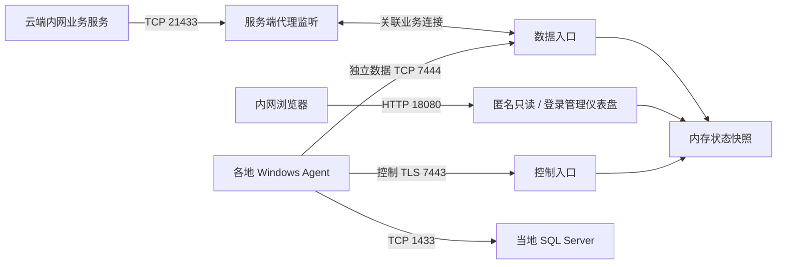
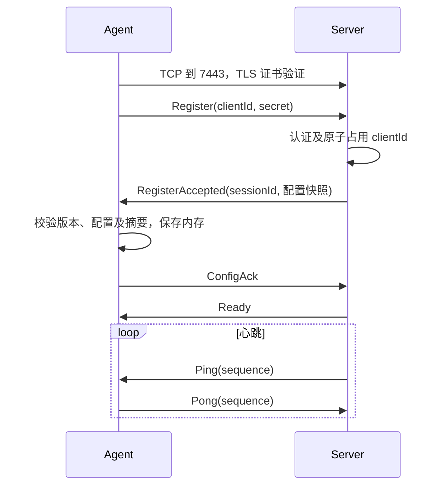
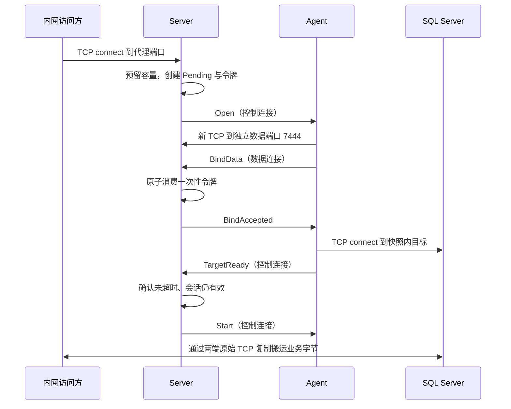

# RelayLink 技术实现文档

文档 ID：DES-001\
状态：Draft（待评审）\
版本：v2.4 设计评审稿\
更新日期：2026-09-18\
调研日期：2026-09-15\
配套文档：[需求文档](../requirements/requirements.md)

## 1. 技术结论

采用 **.NET 10 / C# + Socket + 可选 SslStream + ASP.NET Core** 实现专用反向 TCP 代理。控制连接默认启用 TLS；普通数据连接为独立端口上的原始 TCP，安全取舍见 [ADR-0008](../adr/0008-separated-control-and-raw-data.md)。

- Linux 或 Windows 服务端分别提供控制端口与数据端口；只有已认证控制会话能授权建立数据连接。
- 每个 Windows Agent 保持一条控制连接；每条业务 TCP 连接按需建立一条独立数据 TCP 连接。
- 通道及每客户端密钥保存在服务端每客户端一个 JSON 文件中；启动加载、认证后及管理保存后下发快照。
- Agent 注册时上报本机端到端证书指纹，服务端首次认证并确认配置后固定到对应客户端 JSON；授权通道不保存指纹，访问映射引用目标客户端固定身份。后续变化拒绝自动覆盖；旧通道级字段不兼容，加载时拒绝，见 [ADR-0011](../adr/0011-client-level-e2e-identity.md)。
- 普通代理在数据连接绑定、目标就绪后直接双向复制 TCP 字节；互访仍使用端到端 TLS 与必要的半关闭封装。不实现多业务连接在同一 TCP 上的复用。
- ASP.NET Core 提供内网只读页面和 JSON API；运行状态和计数保存在内存。

这是本项目设计决策，不是声称存在一个原样满足所有要求的现成 .NET 产品。

## 2. 调研与方案比较

| 方案 | 已核实的能力 | 对本需求的适配判断 |
|---|---|---|
| frp TCP 代理 | 在服务端监听远端端口，将连接透明转发至客户端目标；提供多种隧道能力 | 可作为原理与对照实验参考。其官方 TCP 示例由客户端声明代理；直接采用仍需对本项目配置下发和 C# 技术要求作适配 |
| OpenSSH 反向转发 | `ssh -R` 可在远端监听并转发回客户端侧目标 | 可快速验证网络路径；还需自行补集中配置、Windows 服务管理和业务仪表盘，不作为本项目主体实现 |
| 自研 .NET 独立连接隧道 | Socket、SslStream 和后台服务提供所需基础组件 | 与配置、身份、部署及仪表盘要求一致；需承担协议、异常和压测验证工作，推荐首期采用 |
| 自研单连接多路复用 | 将多业务流编码进一条 TCP 隧道 | 可减少连接和握手，但需要流级窗口、公平调度、复用状态机；共享 TCP 丢包会影响多流，首期不采用 |

依据：[frp TCP 文档](https://gofrp.org/en/docs/features/tcp-udp/)、[frp 功能概览](https://gofrp.org/en/docs/overview/)、[OpenSSH 官方手册](https://man.openbsd.org/ssh#R)。适配判断为本次设计分析，不代表这些产品无法通过扩展达到要求。

### 2.1 运行时选择

截至调研日，微软支持表列出 .NET 10 为 LTS，支持结束日期为 2028-11-14；.NET 8 的支持在 2026-11-10 结束。新项目选择 `net10.0`，发布时使用受支持的最新 10.0 补丁并锁定构建依赖。[微软支持策略](https://dotnet.microsoft.com/en-us/platform/support/policy)

不要将“Windows PC”理解为支持所有历史 Windows。实施时以[官方 .NET 10 OS 支持矩阵](https://github.com/dotnet/core/blob/main/release-notes/10.0/supported-os.md)核对设备；不满足条件的老系统先升级或单独立项适配。

## 3. 网络架构



图中连接箭头表示拨号方向，数据传输均可双向。

| 端点示例 | 绑定地址 | 用途 | 可达范围 |
|---|---|---|---|
| TCP 7443 | `0.0.0.0` | 控制连接，默认 TLS | 仅 Agent 可达 |
| TCP 7444 | `0.0.0.0` | 独立数据连接，普通代理明文 TCP | 仅 Agent 可达，并须用受信隔离链路或网络层加密保护 |
| TCP 21433、21434… | `10.20.0.10` | 业务 TCP 监听 | 仅 VPC/局域网，安全组控制 |
| TCP 18080 | `10.20.0.10` | 仪表盘和只读 API | 仅 VPC/局域网，安全组控制 |

公网 IP 若为云平台 NAT 映射地址，不要求它出现在服务器网卡上。接入端口绑定本机地址，由云平台映射。管理端新增普通通道默认以 `0.0.0.0` 监听全部 IPv4 网卡，避免误用 `127.0.0.1` 导致其他主机无法连接；需要仅监听 VPC 网卡时可显式填具体内网 IPv4 地址。新增表单从受保护的 `GET /api/v1/admin/next-channel-port` 获取建议端口：从 19000 递增，跳过控制、数据、仪表盘端口以及所有已配置的普通通道端口（包括禁用通道），并在服务端尝试独占绑定 `0.0.0.0:端口`。仅授权客户端的通道没有云端业务监听，不占用建议端口。接口只给出瞬时建议、不预留；管理员可修改，保存时仍按现有配置冲突及 OS 绑定流程复验。`0.0.0.0` 只是绑定地址，不是调用方连接地址；业务端口仍须由云安全组或防火墙限制在受信任网络，应用层安全组仅作为普通通道的补充来源限制。目标主机名可由 Agent 解析，但必须在连接总超时内完成。

控制和数据连接访问不同服务端端口。控制入口运行可选 TLS 上的自定义协议；数据入口先完成短时绑定帧握手，再转为普通代理原始字节流或互访密文中继。普通代理的目标就绪和开始转发信号始终在控制连接上交换。两者均不能放在仅支持 HTTP 的七层代理后面；如需负载入口须使用四层 TCP 透传，首期直接访问 VM。

## 4. 工程结构与职责

```text
RelayLink.sln
  src/RelayLink.Protocol/         帧编解码、DTO、错误码、协议版本
  src/RelayLink.Transport/        TLS、帧读写、双向转发、超时和计数
  src/RelayLink.Server/           ASP.NET Core Host、后台监听与仪表盘
  src/RelayLink.Agent/            Generic Host、Windows Service、目标连接
  tests/RelayLink.UnitTests/      状态机、配置、令牌及帧边界
  tests/RelayLink.IntegrationTests/ 真实 TCP/TLS、故障及 SQL 接入
```

| 服务端组件 | 职责 |
|---|---|
| ConfigurationLoader | 读取全部配置，验证、建立不可变快照和索引 |
| TunnelAcceptor | 仅接收控制 TCP、可选 TLS 握手、注册认证和预认证连接限制 |
| DataAcceptor | 独立数据监听、一次性令牌绑定与预绑定连接限制 |
| AuthenticationService | 校验客户端 ID、启用状态及密钥 |
| SessionRegistry | 每 ID 单会话、心跳、会话代次及清理 |
| ProxyListenerManager | 每个启用通道的监听器和业务接入门控 |
| PendingConnectionRegistry | 等待关联的业务连接、令牌、期限和容量租约 |
| RelayConnection | 一条业务连接的转发、FIN、终止与最终计数 |
| MetricsRegistry | 客户端/通道聚合和每秒快照采样 |
| Dashboard | 静态页面、只读 API、存活与就绪检查 |

Agent 由 SessionWorker、ConfigSnapshotStore、OpenConnectionHandler 和 RelayConnection 组成。控制消息读取循环不能等待目标拨号完成；Open 请求交给受限并发任务执行，避免慢 SQL 主机阻塞心跳。

Windows Service 使用 `Microsoft.Extensions.Hosting.WindowsServices`，支持同一程序控制台调试。[微软 Windows Service 文档](https://learn.microsoft.com/en-us/dotnet/core/extensions/windows-service)

## 5. 配置模型

### 5.1 服务端基础配置：server.json

```json
{
  "schemaVersion": 1,
  "tunnel": {
    "listenAddress": "0.0.0.0",
    "agentServerHost": "tunnel.example.com",
    "trustedCaPemPath": "/etc/relaylink/tls/root-ca.pem",
    "port": 7443,
    "dataPort": 7444,
    "tlsEnabled": true,
    "certificatePemPath": "/etc/relaylink/tls/fullchain.pem",
    "privateKeyPemPath": "/etc/relaylink/tls/privkey.pem",
    "handshakeTimeoutSeconds": 10,
    "heartbeatIntervalSeconds": 15,
    "heartbeatTimeoutSeconds": 45
  },
  "dashboard": {
    "listenAddress": "10.20.0.10",
    "port": 18080,
    "refreshSeconds": 5,
    "admin": {
      "username": "admin",
      "passwordHash": "PBKDF2-SHA256$210000$<saltBase64>$<hashBase64>",
      "sessionLifetimeMinutes": 60
    }
  },
  "clientsDirectory": "/etc/relaylink/clients",
  "limits": {
    "maxConnections": 2000,
    "maxPendingConnections": 200,
    "maxUnauthenticatedConnections": 100,
    "maxChannelsPerClient": 100,
    "openTimeoutSeconds": 20,
    "blockedWriteTimeoutSeconds": 120,
    "halfCloseDrainTimeoutSeconds": 300
  }
}
```

### 5.2 每客户端文件：clients/shanghai-01.json

```json
{
  "schemaVersion": 1,
  "clientId": "shanghai-01",
  "displayName": "上海节点 01",
  "enabled": true,
  "secret": "REPLACE_WITH_UNIQUE_32_RANDOM_BYTES_BASE64",
  "maxConnections": 100,
  "maxPendingConnections": 20,
  "channels": [
    {
      "channelId": "erp-sql",
      "displayName": "ERP SQL Server",
      "enabled": true,
      "listenAddress": "0.0.0.0",
      "listenPort": 21433,
      "targetHost": "192.168.10.20",
      "targetPort": 1433,
      "maxConnections": 50,
      "targetConnectTimeoutSeconds": 5
    }
  ]
}
```

密钥字段满足“每客户端一个密钥、服务端配置维护”。示例占位值不可用于运行：检查命令拒绝占位值及解码后不足 32 字节的密钥，并拒绝不同客户端复用同一密钥。使用密码学随机数生成至少 32 字节后 Base64 编码；不是人工口令。客户端与服务端仅比较解码后的固定长度字节，使用 `CryptographicOperations.FixedTimeEquals`。文件权限限制为服务账户及管理员可读；不把实际配置提交到代码仓库。

服务端 `tunnel.agentServerHost` 是 Agent 实际连接的 DNS 名称或 IP，不是隧道监听地址或管理页地址。管理端创建客户端时从此字段预填 `agentServerHost`，允许按客户端覆盖；若未配置且 `listenAddress` 为具体地址，则以监听地址预填。监听 `0.0.0.0` 或 `::` 时无法自动推断公网地址，必须显式配置或在创建时填写，不能从浏览器地址推断（管理页可能经 SSH 转发）。服务端创建接口在客户端未提交该值时同样使用上述默认值。TLS 启用时，所用地址必须匹配服务端证书 SAN。服务端 `tunnel.trustedCaPemPath` 指向仅含 CA 公钥证书的 PEM 文件，管理端不要求填写 Agent 本机 CA 路径；下载 Agent 配置时读取该文件并以 `trustedCaPemBase64` 内嵌。服务端不允许将私钥放入此字段。完整脱敏示例以 [客户端配置示例](../../config/examples/client.example.json) 为准。

### 5.3 Agent 本地配置：agent.json

```json
{
  "serverHost": "tunnel.example.com",
  "serverPort": 7443,
  "dataPort": 7444,
  "useTls": true,
  "clientId": "shanghai-01",
  "secret": "REPLACE_WITH_SAME_CLIENT_SECRET",
  "trustedCaPemBase64": "REPLACE_WITH_BASE64_OF_CA_CERTIFICATE_PEM",
  "reconnect": {
    "initialDelaySeconds": 1,
    "maxDelaySeconds": 30,
    "permanentErrorDelaySeconds": 60
  }
}
```

`serverHost` 同时用于控制与数据连接的 DNS，控制 TLS 还用它校验服务端名称。`serverPort` 指控制入口，`dataPort` 指独立数据入口；旧配置缺少 `dataPort` 时默认为 `serverPort + 1`。若直接使用 IP，控制证书必须含匹配 IP SAN。TLS 配置使用 `trustedCaPemBase64`：它是 CA 证书 PEM 文本的 UTF-8 字节经 Base64 编码，不含私钥。Agent 从配置解码后构建私有信任链，不读取操作系统根证书库，仍校验证书链、CA 属性和名称。旧 Agent 配置的 `trustedCaPemPath` 可继续读取以便迁移，但新下载配置不再生成路径，也不允许同时给出两种信任来源。私有 CA 未提供 CRL/OCSP 时无法进行在线吊销检查；如需吊销，须先为签发链提供可访问的吊销服务并扩展相应策略。本地配置没有 `channels`、目标或代理端口字段，出现这些字段应报配置错误，避免误以为本地配置会生效。

### 5.4 下发快照

只下发该客户端的 ID、展示名、限制、通道信息，以及 `configVersion`。显式 DTO 白名单序列化；绝不将原始配置对象直接作为响应。密钥、证书路径、其他客户端配置均不下发。

`configVersion` 是固定字段顺序、按 channelId 排序后 UTF-8 JSON 的 SHA-256 十六进制摘要；不包含密钥和机器路径。双方使用共享序列化规则校验摘要。所有通道，包括禁用通道，可以在快照中出现；Agent 只接受已启用通道的 Open 请求。

### 5.5 加载与生效

1. 启动显式读取 `server.json` 及目录中全部 `*.json`，禁止自动 reload。
2. 严格解析：拒绝重复 JSON 属性、未知字段、无效 schema、重复 ID、无效限额；客户端和通道 ID 匹配 `[a-z0-9][a-z0-9_-]{0,63}`，channelId 在客户端内唯一。端到端访问入口 ID 由两个最长 64 字符的目标 ID 和连接符组成，最多 129 字符；旧入口 ID 仍可加载。
3. 文件名须等于 `clientId.json`；认证只查询已加载字典，不拼接客户端输入读取路径。
4. 校验启用端点全局唯一，排除与接入/仪表盘的绑定冲突；校验完整快照不超过 256 KiB。
5. 创建所有启用通道监听器。任一绑定失败，撤销已创建监听器并使启动失败；静态检查不能保证 OS 端口实际可绑定。
6. 所有必要监听成功后，服务进入 ready；客户端是否在线不影响进程 ready。
7. 通道监听器在 Agent 离线时继续占用端口，但 accept 后立即关闭业务连接，并记录离线拒绝。

`--check-config` 只做解析与静态校验，不监听网络；正常启动才检查实际端口占用。仪表盘保存先校验完整配置、启动新增监听、原子写入客户端 JSON，再切换运行时快照；按客户端及通道/访问映射比较更新前后的记录，仅真实变化时撤销受影响的待建立与已建立连接，然后向在线 Agent 下发快照。相同内容保存仍沿用持久化和下发流程，但不撤销连接；其他通道连接不受影响。若旧、新监听地址在同一端口重叠（例如 `127.0.0.1` 改为 `0.0.0.0`），须先短暂停止旧监听再绑定新监听；绑定失败时恢复旧监听并返回明确错误，不写入新配置或撤销旧连接。该切换可能短暂影响新连接的接入。详情见 [ADR-0009](../adr/0009-revoke-connections-on-channel-change.md)。直接改文件、密钥或基础服务端配置仍须在维护窗口重启。

客户端禁用是独立于单条通道变更的安全操作：被其他客户端端到端入口引用不妨碍保存，因为入口元数据及授权材料保持不变；运行时目标是否启用仍在每次建立连接时检查。配置原子写入并切换后，停止该客户端的云端监听，撤销其普通连接与以其为访问方或目标方的端到端连接，关闭控制会话；新认证、业务接入及入口请求均拒绝。重新启用只恢复原配置，不复活旧连接。

管理端创建端到端访问入口时只提交目标客户端 ID 与目标通道 ID；服务端生成 `<目标客户端 ID>-<目标通道 ID>` 作为入口 ID，默认启用，重复 ID 返回错误。入口无 PUT 修改路由；管理端只提供创建和删除。删除后重建会触发旧连接撤销和新配置下发，旧配置中的自定义入口 ID 保持可读、可删。

应用层安全组保存在 `server.json` 的 `securityGroups` 数组（ID、名称、非空 `entries`）；普通通道可设置 `securityGroupId`，缺省或 `null` 表示任意来源。条目仅为 IPv4/IPv6 单地址或 CIDR，按服务端 TCP socket 的 `RemoteEndPoint` 判断，不信任 HTTP 转发头；IPv4-mapped IPv6 来源归一化为 IPv4。解析失败、组不存在或地址族不匹配均拒绝，不把错误策略解释为全开放。安全组写操作与客户端/通道配置写操作共用序列化锁，先验证引用及格式，再原子替换 `server.json` 和运行时快照；更新组规则时撤销不再匹配的存量连接。被任一通道引用时拒绝删除安全组；端到端专用通道不得绑定安全组。该功能不改变 Agent 快照和内层端到端转发。架构取舍见 [ADR-0012](../adr/0012-application-security-groups.md)。

## 6. TLS 与认证

控制端口接受 TCP 后在启用 TLS 时先完成 TLS，再解析注册协议。服务端加载带私钥的证书和完整链，Agent 验证信任链、有效期、服务端名称，禁止无条件通过证书校验。数据端口当前不使用外层 TLS；普通代理内容及绑定元数据在该链路上不保密。互访业务另由两端 Agent 的内层 TLS 保护。

采用 OS 的 TLS 协议/密码套件策略，部署基线要求至少 TLS 1.2，支持时使用 TLS 1.3；不为旧设备开启过期协议。服务端复用 `SslStreamCertificateContext`，避免每连接重复构建证书上下文。[SslStream 最佳实践](https://learn.microsoft.com/en-us/dotnet/core/extensions/sslstream-best-practices)

首期使用 TLS 内的 `clientId + secret` 认证，不引入额外自定义挑战签名或 mTLS。密钥不直接用于每条业务隧道；后者使用绑定会话的一次性随机令牌。

预认证 TLS 并发上限和握手期限属于资源保护，不是网络 ACL。身份错误对外统一返回 `AUTH_FAILED`，服务端日志按内部原因区分，且不记录提交的密钥。

## 7. 协议 v2

### 7.1 通用帧格式

控制连接中的所有消息及数据连接的短时绑定握手采用相同帧头，不依赖 TCP 分包边界。普通代理在控制连接收到 `Start` 后转为原始 TCP 字节流，不再解析数据连接上的帧。

| 偏移 | 长度 | 字段 |
|---|---|---|
| 0 | 4 字节 | ASCII magic：`NTP1` |
| 4 | 1 字节 | version，固定 2；旧版共享入口协议被拒绝 |
| 5 | 1 字节 | type |
| 6 | 2 字节 | flags，v2 必须为 0，大端 |
| 8 | 4 字节 | payloadLength，无符号大端，不含头 |
| 12 | N 字节 | payload |

约束：控制 JSON 最多 256 KiB，首帧最多 8 KiB，DATA 载荷 1～32 KiB，FIN 载荷为 0，RESET JSON 最多 1 KiB。读完头先验证长度再申请缓冲。保留类型、非法 flags、无效状态下的帧、截断帧均视为协议错误。连接关闭前不足一帧不能当作正常 FIN。

### 7.2 消息与必要字段

| type | 名称 | 方向/字段 |
|---|---|---|
| 1 | Register | Agent→Server；clientId、secret、agentVersion |
| 2 | RegisterAccepted | Server→Agent；sessionId、configVersion、config、heartbeatIntervalSeconds、heartbeatTimeoutSeconds |
| 3 | ConfigAck | Agent→Server；sessionId、configVersion |
| 15 | ConfigUpdate | Server→Agent；sessionId、configVersion、配置快照；Agent 验证哈希后以 ConfigAck 确认 |
| 4 | Ready | Server→Agent；sessionId |
| 5 | Ping | Server→Agent；sequence |
| 6 | Pong | Agent→Server；相同 sequence |
| 7 | Open | Server→Agent；sessionId、connectionId、channelId、configVersion、token、remainingOpenTimeoutMs |
| 8 | OpenFailed | Agent→Server；sessionId、connectionId、errorCode |
| 9 | CancelOpen | Server→Agent；sessionId、connectionId、reason |
| 10 | BindData | Agent→Server，数据连接首帧；sessionId、connectionId、channelId、token |
| 11 | BindAccepted | Server→Agent；connectionId |
| 12 | TargetReady | Agent→Server，控制连接；connectionId、targetConnectDurationMs |
| 13 | Start | Server→Agent，控制连接；connectionId |
| 14 | Error | 任一端→对端；code，不含异常堆栈或秘密 |
| 32 | Data | 仅互访数据中继；内层 TLS 密文块 |
| 33 | Fin | 仅互访数据中继；该发送方向结束 |
| 34 | Reset | 仅互访数据中继；异常终止 |

除 Data/Fin 外使用 UTF-8 JSON。sessionId、connectionId 使用随机 UUID，clientId 和 channelId 使用配置中的稳定标识；令牌使用 32 字节随机数的 Base64。所有注册、确认、绑定和启动消息单次出现，重复消息不得重复建立连接或重复计数。控制入口仅允许 Register 及后续控制消息；数据入口仅允许 BindData 或 PeerBindData 首帧。普通数据连接只在绑定时使用帧；`BindAccepted` 后静待控制连接上的 `Start`，其后任何字节都视为原始业务数据。

### 7.3 控制会话流程



服务端先按顺序写出 Ready，再允许该会话接收 Open；Agent 收到 Ready 才进入 Online。注册到 Ack 最长 10 秒，超时释放占用。并发注册由按 ID 的原子操作决定唯一赢家。旧会话清理必须比较 sessionId，只能删除自身，不能删除已重连的新会话。

RTT 用服务端单调时钟计算，不依赖两地时钟同步；只有匹配已发 sequence 的 Pong 更新心跳。Agent 同样在 45 秒没有服务端 Ping 时退出会话。其他消息不无限延长心跳寿命。

### 7.4 一条业务连接的建立



访问方的 TCP 握手可能在隧道就绪前已经成功；不等于 SQL 连接成功。服务端就绪前不循环读取业务数据，只使用 OS 有界接收缓冲；客户端可能已写入的 SQL prelogin 字节会在 Start 后转发。

Open 仅含 channelId，不接受动态目标地址。Agent 从已确认快照解析目标，检查 sessionId、configVersion 和通道启用状态，禁止将接入端变成任意目标代理。

期限从服务端 accept 开始计 20 秒，是绑定、目标拨号、Start 的总预算，不是各步累加。Agent 按收到的剩余预算计算自己的截止时间；服务端期限始终权威。目标拨号还受 5 秒子期限约束，DNS 与所有 IP 尝试共享该期限。

### 7.5 数据令牌与竞争处理

Pending 项绑定 `{sessionId, connectionId, channelId, tokenHash, deadline, state, businessSocket, capacityLease}`。仅属于当前在线会话且未超时的 Pending 可绑定；通过 CAS 从 AwaitingBind 变为 Bound 并清除令牌哈希。令牌只能成功消费一次，不在失败后恢复可用。

- Bind 与超时、取消竞争时，只允许一个终态胜出；迟到数据连接立即关闭。
- 超时任务覆盖 Bound/等待目标阶段，不能仅在未绑定时生效。
- 目标连接失败：Agent 发送 OpenFailed 并关闭数据连接；即使消息丢失，服务端也从 EOF 或总期限清理。
- 接收 TargetReady 后，如果业务端已明确异常或会话过期，不发送 Start，释放目标连接。
- 访问方等待期间发送 FIN 可能表示合法半关闭，不能仅因零字节可读就当作取消；Start 后按 FIN 流程处理。RST/异常和总超时才终止。
- CancelOpen 最好努力通知；Agent 的总期限兜底清理。完成、异常、取消均通过一次性终结入口释放配额和 socket。

## 8. 数据平面与半关闭

### 8.1 两个方向

对每条连接，两端均运行两个异步循环：

1. 本地 TCP `ReceiveAsync` → 数据 TCP `SendAsync`。
2. 数据 TCP `ReceiveAsync` → 本地 TCP `SendAsync`。

普通代理在 `Start` 后只复制字节，不对业务数据加帧或叠加 TLS。每个方向只保留一个有界缓冲，写完已读内容才继续读；发送异常时取消另一个方向并关闭两端 socket。互访使用内层 TLS 与已有帧化适配器，其半关闭规则见[安全互访设计](agent-to-agent.md)。

数据绑定握手使用 `ReadExactlyAsync` 读取帧；目标就绪与 Start 在控制连接上传递，进入业务阶段后数据连接不再调用帧读取器。`SendAsync` 循环处理部分发送；不能假定一次调用写完。参见 [Socket.Shutdown API](https://learn.microsoft.com/en-us/dotnet/api/system.net.sockets.socket.shutdown?view=net-10.0)。

### 8.2 半关闭语义

普通代理某方向读到 EOF 后，已读字节先全部发送完成，再对相对端 socket 执行 `Shutdown(Send)`，另一方向继续接收反向尾包。

双方都 EOF 且已读字节全部发送完成后才正常释放连接。异常、RST 或会话取消会终止两个方向；不会恢复原连接或重放业务数据。互访仍以内层应用 EOF 标记实现半关闭，不能把普通代理的 socket 半关闭规则直接套用于内层 `SslStream`。

半关闭后剩余方向允许继续传输，默认最多等待 300 秒结束。此期限是有意的资源保护限制，可按实际协议提高；正常 SQL 空闲或长查询没有发送 Fin，不受此期限影响。

### 8.3 背压与超时

每个方向最多持有一个约 32 KiB 缓冲，写入完成后才读取下一块。慢目标使读取自然暂停，通过 TCP 窗口反馈背压。每条普通连接在 Server 和 Agent 各使用约 64 KiB 应用缓冲；不含内核 socket 缓冲、对象和运行时内存。

代理入口、Agent 数据隧道和目标 TCP 连接启用 `TCP_NODELAY`，避免小帧交互在多段 TCP 链路上叠加 Nagle 等待；这会增加小包数量，需以交互延迟和吞吐实测评估取舍。控制连接也启用该选项，以降低通道建立消息的往返延迟。

业务正常 Read 默认无限等待，用会话取消和 TCP keepalive 发现断开，不设置短 SQL 空闲超时。单次阻塞写默认 120 秒超时；超时代表连接已经不可按预期推进，直接终止，不能重试可能已部分发送的字节。绑定握手受短期限约束，进入原始流后不存在逐块帧读取期限。

开启 socket TCP keepalive，建议闲置 60 秒后探测、间隔 15 秒、失败次数 3，具体跨平台选项和实测识别时间在集成测试中验证。控制连接活着不证明每条闲置数据 TCP 仍畅通；最坏情况下依赖数据 keepalive 或下一次业务读写发现故障。

## 9. 状态与故障恢复

### 9.1 状态模型

```text
Agent：Disconnected → Connecting → Authenticating → Configuring → Online
        ↑                                                        |
        └──────────────── Backoff ←──────────────────────────────┘

业务连接：Accepted → AwaitingBind → Bound → TargetConnecting
          → Relaying → HalfClosed → Closed
          任一非终态 → Failed/Cancelled（统一释放）
```

客户端展示 Offline/Connecting/Online/Disabled。由于服务端无法观测到尚未到达的拨号，服务端 UI 的 Connecting 仅表示已认证且正在配置确认的阶段。

通道分别维护 ConfigEnabled、ListenerState、SessionAvailable、TargetLastResult；可接入状态由前三项派生，避免把一组不同性质的信息压成一个绿色灯。

### 9.2 控制连接丢失

选择一致且易运维的首期策略：控制连接 EOF、错误或心跳超时后，服务端原子失效该会话，拒绝新业务，取消 Pending，关闭该会话全部 Relay。Agent 同样关闭本会话的目标连接和数据隧道，清空内存配置，然后重连。

此设计会在“只有控制连接异常、数据连接本可存活”时也中断业务，是明确的首期取舍。避免旧会话继续工作、令牌失去生命周期管理或密钥撤销后存量连接悬挂。

### 9.3 重连和错误策略

普通网络失败等待 `random(0, min(30s, 1s × 2^attempt))`；持续在线 60 秒后清零退避次数。认证拒绝、协议不兼容和重复会话等待 `60s + random(0,15s)` 并记录清晰原因。本地配置错误退出非零，交由运维修改，不不断尝试同一错误配置。

| 场景 | 处理 |
|---|---|
| 单条数据隧道失败 | 关闭对应业务和目标，控制连接及其他数据流继续 |
| 目标失败 | 当前建立计失败，下一次业务请求重新尝试，不做目标全局熔断 |
| 达到容量上限 | accept 后尽快关闭，标记 LIMIT_EXCEEDED，不无限排队 |
| 心跳黑洞 | 45 秒失效会话；重新认证获取新 sessionId |
| 服务端重启 | 全量断连、统计重置，Agent 退避重连 |
| 密钥轮换 | 修改文件并重启服务端；旧会话全部失效，新认证按新快照 |
| 管理端禁用客户端 | 完整配置持久化；停止监听、撤销相关普通及端到端连接、关闭控制会话，直到重新启用前拒绝新认证和业务接入 |
| SQL 执行中断 | 返回连接错误，由业务判断事务结果；代理绝不重放 |

## 10. 统计与仪表盘实现

### 10.1 统一口径

以服务端为唯一累计统计源，Agent 不再上报一份字节累计后相加。

- `bytesToTarget`：服务端成功写入数据隧道的 DATA 载荷字节，访问方→目标方向。
- `bytesToCaller`：服务端成功写入访问方 TCP 的 DATA 载荷字节，目标→访问方方向。
- 两者不含帧头、TLS/TCP 开销；成功写入代表转交给传输层，不证明 SQL 已消费或提交。
- 写入异常时可能有部分字节已发送，累计为成功完成操作的载荷下界，不用于计费。
- `acceptedTotal`：通道 accept 成功次数，含离线/容量拒绝。
- `openedTotal`：服务端发出 Start 并进入 Relay 的次数，不代表 SQL 登录成功。
- `openFailedTotal`：Relay 前终结的连接数，按错误原因分类。
- `activeConnections`：处于 Relay/HalfClosed 的连接数；`pendingConnections` 为已接收但未进入 Relay 的数量。
- `normalClosedTotal` / `abortedTotal`：建立后的正常/异常终结数，分别记录，不混入建立失败。

快照一致时满足：`acceptedTotal = pendingConnections + openedTotal + openFailedTotal`，`openedTotal = activeConnections + normalClosedTotal + abortedTotal`。使用每通道短临界区完成生命周期计数变更，快照统一读取；字节用 Interlocked 64 位计数，允许与生命周期快照相差一个采样周期。

每秒取一次计数，速率使用最近 5 秒差值/单调时间差；不足 5 秒使用实际窗口。响应携带 `serverInstanceId`、`statsSinceUtc`、`snapshotTimeUtc`，防止进程重启后算出负速率。客户端重连不清空服务端累计，但目标当前状态重置 Unknown。`history.enabled` 时，服务端最多每 5 秒从累计计数求差，按 UTC 分钟以 SQLite UPSERT 保存通道级增量；普通代理业务字节与端到端密文 DATA 载荷字节分列，默认保留 90 天。旧 `.jsonl` 配置派生同名 `.db` 并一次性导入，旧文件保留。分钟归属按采样时刻，不能作为计费依据；详见 [ADR-0010](../adr/0010-sqlite-minute-traffic-history.md) 与 [审计与流量设计](audit-and-traffic.md)。

### 10.2 页面布局

```text
内网 TCP 代理    统计自：...    数据更新：...    [名称/ID 搜索] [状态]
在线客户端  80/100 | 可接入通道 400/500 | 活动连接 650 | →目标 / →访问方速率

▼ 上海节点 01  [Online]  RTT 48ms  最近心跳 ...  Agent 版本 ...
  通道       云端端点              目标                  接入       最近目标结果
  ERP SQL    10.20.0.10:21433     192.168.10.20:1433   可接入     TCP成功（时间）
             活动 12 / 等待 1 / 建立失败 3 / →目标 1.2 MiB/s / →访问方 4 MiB/s
▶ 成都节点 02  [Offline] 最近断线 ...
```

采用 ASP.NET Core Minimal API + `src/RelayLink.AdminWeb` 独立 React/TypeScript/Vite 项目。构建输出复制到 Server 的 `wwwroot/` 由同源静态文件中间件托管，不依赖外部 CDN；生产发布物不依赖 Node.js。React 默认转义配置展示名称，目标地址属于内网运维信息，不向公网提供。页面不设左侧侧栏；匿名只读，客户端卡片下的端到端访问入口以表格展示入口 ID、当前 Agent 上报的本机地址、目标和状态；仅登录后显示删除操作。登录入口点击后以弹窗呈现；管理表单打开时暂停轮询。架构决定见 [ADR-0004](../adr/0004-standalone-admin-web.md)。

点击通道的“建连中 / 转发中”数字打开实时连接弹窗；普通代理与端到端转发分别从运行时连接注册表读取，使用同一连接 ID 关联协议和管理操作。列表含来源（普通代理为远端 IP:端口，端到端为访问方客户端 ID）、阶段、建立时间与两个方向的已转发字节；端到端字节为服务端可见的密文 DATA 载荷，不表示业务明文。弹窗每 5 秒刷新，也可手动刷新；匿名可读，已登录管理员可在二次确认后断开单条连接。断开通过取消连接生命周期令牌释放数据通道与配额，不删除通道配置；ID 必须同时匹配目标客户端及通道，已结束连接返回 404。运行时快照与汇总计数由不同并发结构读取，瞬时竞争下可能短暂不一致。

### 10.3 HTTP API

| 方法与路径 | 响应 |
|---|---|
| GET `/api/v1/overview` | 总览计数、实例与采样时间 |
| GET `/api/v1/clients` | 客户端列表，支持 query/status/page/pageSize，pageSize ≤ 100 |
| GET `/api/v1/clients/{id}/channels` | 所属通道状态、配置和计数，响应封装采样时间 |
| GET `/api/v1/clients/{id}/channels/{channelId}/connections` | 匿名只读；当前普通/端到端连接的 ID、来源、阶段、建立时间及方向字节，不含令牌或业务载荷 |
| GET `/api/v1/clients/{id}/mappings` | 匿名只读；入口 ID、启用及上报状态、本机地址、目标客户端/通道，不含访问密钥和目标证书指纹 |
| GET `/api/v1/history` | 历史通道分钟增量，支持 clientId、channelId 与 hours（最长 365 天）；查询超过 24 小时按 15 分钟或小时聚合 |
| POST `/api/v1/admin/session` | 管理员登录，创建 HttpOnly 会话 Cookie，返回 CSRF 令牌 |
| GET `/api/v1/admin/session` | 返回当前会话认证状态；已登录时返回 CSRF 令牌 |
| GET `/api/v1/admin/audit` | 需管理员会话；按 hours（1–2160）、eventType、clientId、page、pageSize（≤100）查询 SQLite 审计事件，不返回凭据或业务载荷 |
| DELETE `/api/v1/admin/session` | 注销当前管理会话 |
| POST `/api/v1/admin/clients` | 需会话与 CSRF 令牌；创建独立密钥客户端配置 |
| PUT `/api/v1/admin/clients/{id}` | 需会话与 CSRF 令牌；编辑显示名、启用状态与连接上限；禁用时立即撤销该客户端相关连接并停止监听 |
| GET `/api/v1/admin/clients/{id}/agent-config` | 需会话；下载包含独立密钥的 Agent JSON 配置，响应不得缓存或写日志 |
| GET/POST `/api/v1/admin/security-groups` | 需管理员会话；写入另需 CSRF；列出或新增安全组 |
| PUT/DELETE `/api/v1/admin/security-groups/{id}` | 需管理员会话及 CSRF；修改或删除安全组；被通道引用时不可删除 |
| POST `/api/v1/admin/clients/{id}/channels` | 需会话与 CSRF 令牌；新增通道并立即更新监听、下发快照 |
| PUT `/api/v1/admin/clients/{id}/channels/{channelId}` | 需会话与 CSRF 令牌；修改或禁用通道，立即更新监听、下发快照 |
| DELETE `/api/v1/admin/clients/{id}/channels/{channelId}` | 需会话与 CSRF 令牌；停止监听、删除通道并下发快照 |
| DELETE `/api/v1/admin/clients/{id}/channels/{channelId}/connections/{connectionId}` | 需会话与 CSRF 令牌；仅断开与客户端、通道和 ID 全部匹配的存量连接，成功返回 204，不匹配返回 404 |
| GET `/health/live` | 进程存活，200 |
| GET `/health/ready` | 配置与必要监听完成为 200，否则 503 |

未找到客户端返回 404；非法分页 400。除受会话和 CSRF 保护的客户端、通道管理接口外，不提供其他业务写接口或 HTTP 重启接口。`Cache-Control: no-store`，不启用跨域访问，敏感字段使用独立响应 DTO 排除。仪表盘默认每 5 秒拉取一次；编辑弹窗打开时暂停自动刷新，数据超过两个刷新周期未更新时提示过期。

审计默认与流量历史共用 SQLite 数据库，也可配置 `audit.filePath`；无历史配置时默认在服务端配置文件目录创建 `audit.db`。起始审计落库后才允许成功登录、Agent Ready 或业务数据开始转发；存储不可写时拒绝新连接。默认保留 90 天，管理员可从管理页顶部的审计弹窗查询。故障取舍与运维边界见[审计与流量设计](audit-and-traffic.md)及 [ADR-0013](../adr/0013-sqlite-audit-gate.md)。

## 11. 资源限制与运行参数

| 参数 | 默认 | 说明 |
|---|---|---|
| 全局连接额度 | 2,000 | Pending + Active 共用，先获取再分配工作资源 |
| 全局 Pending 上限 | 200 | 已包含在总额度内，不是额外 200 条 |
| 每客户端总额度 | 100 | 配置可调 |
| 每客户端 Pending 上限 | 20 | 与其总额度同时满足 |
| 每通道总额度 | 50 | 配置可调 |
| 每入口预认证连接上限 | 100 | 控制 TLS/首帧与数据绑定首帧分别限制 |
| TLS/首帧阶段总期限 | 10 秒 | 每条接入连接从 accept 开始 |
| 控制配置确认期限 | 10 秒 | 认证成功后计时 |
| 业务总建立期限 | 20 秒 | 从业务 accept 起，覆盖所有步骤 |
| 控制心跳 | 15 / 45 秒 | 发送间隔 / 无响应期限 |
| 普通代理复制缓冲 | 每方向 32 KiB | 不对业务数据分帧；互访 DATA 帧仍有 32 KiB 上限 |
| 控制发送队列 | 256 帧 | 有界，溢出使会话失败并清理 |
| 阻塞写期限 | 120 秒 | 失败直接关闭，不重放；数据绑定首帧另受握手期限约束 |
| 半关闭尾部等待 | 300 秒 | 可调整；不等于普通业务空闲超时 |

全局、客户端、通道配额以固定顺序获取，不满足立即回滚已经获得的额度，不等待锁链。关闭用一次性 lease Dispose，避免取消竞争造成额度泄露。Agent 按下发上限独立限制目标拨号任务。

服务端连接句柄估算为 `2×活动连接 + 待建立连接的1～2倍 + 控制连接数 + 通道监听数 + 其他开销`。Linux 按峰值加余量设置 systemd `LimitNOFILE`（初始可设 16,384）；Windows 同样须在目标环境按句柄、临时端口及安全软件限制验证。全国站点同一 NAT 下的数据连接大量并发会消耗临时端口和 NAT 表项，必须纳入压测。首期不预建空闲数据连接池，主要依赖业务 SQL 连接池摊薄握手成本。

## 12. SQL Server 专项说明

### 12.1 固定端点

SQL Server 配置固定 TCP 端口，云端驱动连接代理内网端点。SQL Browser 的 UDP 1434 发现流程不穿过本服务。[SQL Server 连接排障](https://learn.microsoft.com/en-us/troubleshoot/sql/database-engine/connect/network-related-or-instance-specific-error-occurred-while-establishing-connection)

### 12.2 TLS、认证和连接字符串

Microsoft.Data.SqlClient 5.0+ 支持显式设置证书期望主机名；该选项在 Mandatory/Strict 加密模式下适用。[HostNameInCertificate 官方文档](https://learn.microsoft.com/en-us/dotnet/api/microsoft.data.sqlclient.sqlconnectionstringbuilder.hostnameincertificate?view=sqlclient-dotnet-core-6.1)

```text
Server=tcp:10.20.0.10,21433;
Database=ERP;
User ID=app_user;
Password=<由业务凭据系统提供>;
Encrypt=Mandatory;
TrustServerCertificate=False;
HostNameInCertificate=sql-shanghai.example.internal;
Connect Timeout=30;
```

示例须按实际驱动版本、数据库证书和 CA 信任配置验证，不是可直接复制的凭据。SQL 的证书期望名称与 Agent 用来校验公网隧道证书的名称不同。不要把 `TrustServerCertificate=True` 设为默认修复手段。

外层 TLS 仅覆盖 Agent↔服务端；SQL 原生 TLS 由业务驱动和数据库端到端协商，原样穿透，可覆盖两端局域网路段。SQL Server 看到的 TCP 来源是 Agent，不是云端访问方原始 IP。代理不改写 TDS，也不代理数据库身份。

### 12.3 业务限制

SQL 驱动可能通过协议获得其他主机/端口并重新连接，例如某些高可用或只读路由场景。本服务不改写这些地址；首期只保证固定实例端点路径，额外端点需单独设计和验证。Windows 集成认证依赖域与 SPN 等外部条件，不能因 TCP 可通就承诺可用。

断线可能发生在数据库已经提交、客户端尚未收到响应之间。代理不判断事务结果、不重放语句；业务的重试必须遵循自身幂等和事务规则。

## 13. 部署与运维

### 13.1 服务端：Linux 或 Windows

服务端可部署到 Linux 或 Windows VM；内网仪表盘由 Kestrel 直接监听，不要求 Nginx 或 IIS 反向代理。Linux 由 systemd 管理；Windows 由 Windows Service 管理，使用与 Agent 相同的 Generic Host 服务生命周期支持。[Linux 托管文档](https://learn.microsoft.com/en-us/aspnet/core/host-and-deploy/linux-nginx?view=aspnetcore-10.0) [Windows Service 文档](https://learn.microsoft.com/en-us/dotnet/core/extensions/windows-service)

目录建议：`/opt/relaylink/server` 程序；`/etc/relaylink/server.json`；`/etc/relaylink/clients/*.json`；`/etc/relaylink/tls`。使用专用非 root 用户，配置和密钥文件只读，所有示例端口均大于 1024。

```ini
[Unit]
Description=RelayLink TCP Tunnel Server
After=network-online.target
Wants=network-online.target

[Service]
Type=simple
User=relaylink
Group=relaylink
WorkingDirectory=/opt/relaylink/server
ExecStart=/opt/relaylink/server/RelayLink.Server --config /etc/relaylink/server.json
Restart=on-failure
RestartSec=5
TimeoutStopSec=40
LimitNOFILE=16384

[Install]
WantedBy=multi-user.target
```

Linux 对应 systemd 模板见 [deploy/linux/relaylink-server.service](../../deploy/linux/relaylink-server.service)，部署步骤见 [deploy/linux/README.md](../../deploy/linux/README.md)。Windows 发布及 Service 安装见 [deploy/windows/README.md](../../deploy/windows/README.md) 和 [deploy/windows/install-server-service.ps1](../../deploy/windows/install-server-service.ps1)。Windows 服务账号需要对程序、配置、客户端目录及证书私钥有最小读取权限，并能够绑定配置端口。服务端重启依旧不提供无损迁移。证书续期在外部完成后安排重启加载；如使用 ACME DNS 验证，无须为签发额外开放 HTTP 入站端口。

### 13.2 Windows Agent

发布 win-x64 自包含包，使用 [Windows Agent 安装包](../../deploy/windows/README.md) 选择并校验配置；首次安装及重新配置无 JSON 不得继续。程序位于 Program Files，配置和 TLS 信任 CA 复制到受限的 ProgramData 目录，Agent 生成的身份及端口状态也存于该目录。服务以 LocalService 运行，开机自动启动并配置失败恢复；安装成功后按 `dashboardPort` 在公共桌面创建指向本机状态页的 Internet Shortcut，由系统默认浏览器打开，状态页关闭时不创建。安装和卸载需要本机管理员权限。已有安装须显式选择仅更新或重新配置，且校验服务确属当前安装：仅更新停止服务、替换程序并重启，不触碰 ProgramData；重新配置在校验新 JSON 后清理 ProgramData 中 Agent 管理的配置、CA、身份、端口状态和诊断日志，写入新配置再重启，并更新快捷方式。不清理未知文件、Windows 事件日志或其他应用目录。卸载移除安装程序生成的快捷方式，但保留敏感配置与身份文件供管理员处理。实际架构不同则另行构建；生产连接和 Windows Service 生命周期仍需目标机验收。

### 13.3 运维步骤

1. 分配唯一 clientId、独立随机密钥及未占用代理端口。
2. 写入对应 JSON，运行配置检查；确认安全组允许规定路径。
3. 服务端启动或维护窗口重启；检查 ready 和监听端口。
4. 向 Agent 配置服务端域名、ID 和同一密钥；安装服务。
5. 在仪表盘确认 Online 和通道可接入，再由云端业务实际 SQL 登录查询。
6. 从仪表盘更新通道时，确认保存结果显示监听更新和配置下发；直接修改配置文件或密钥时仍安排维护窗口重启，并保留上一版文件用于回滚。
7. 密钥轮换需同步更新 Agent 和服务端并重启相应进程；首期不支持双密钥重叠窗口，维护期间存在短暂中断。

管理密码使用 `scripts/new-admin-password-hash.ps1` 生成 PBKDF2-SHA256 哈希后填入配置；不得提交明文密码或真实哈希。管理登录依赖内网访问控制，生产环境应通过 HTTPS 或受信任的内网 TLS 终结保护登录请求。结构化日志字段：timestamp、level、eventId、clientId、channelId、sessionId、connectionId、durationMs、errorCode。记录连接建立和关闭摘要，不逐 DATA 帧打日志。日志轮转和保留由部署环境统一设置。

## 14. 测试与实施顺序

### 14.1 必测边界

- 帧头任意拆分、粘连、最大长度、恶意超长、截断 JSON、错误类型和 FIN 后 DATA。
- 双向并发随机字节流与哈希验证，慢读写背压、部分发送和半关闭尾部响应。
- 同 ID 并发注册、旧会话清理与新会话创建竞争。
- Bind、TargetReady、超时、Cancel 和断线同刻发生，令牌恰好消费一次、配额恰好释放一次。
- 一个目标黑洞时心跳继续；控制会话失效时其全部资源回收。
- 数据连接独立黑洞但控制正常，验证 keepalive/阻塞写期限。
- 长时间 SQL 查询、连接池闲置复用、SQL TLS 名称校验、事务中断和大结果集。
- 服务端重启、Agent 强杀、端口占用、错误配置，仪表盘显示和计数不失真。

### 14.2 实施阶段和退出条件

| 阶段 | 内容 | 完成条件 |
|---|---|---|
| P0 协议原型 | TLS、注册配置、单连接 DATA/FIN、SQL 固定端口 | Linux↔Windows 实机双向字节和半关闭正确 |
| P1 核心服务 | 多客户端/通道、配额、一次性令牌、超时重连 | 并发与故障竞争测试通过 |
| P2 可运维交付 | 匿名只读/登录管理仪表盘、配置检查、systemd/Windows Service | 操作流程和需求验收逐项通过 |
| P3 稳定性 | WAN 模拟、SQL 场景、24 小时压测 | 提交基线报告、缺陷修复和部署参数 |

性能测试记录运行时补丁、CPU、内存、NIC、真实链路 RTT/丢包、SQL 版本与驱动、测试块大小和连接模型。先在无 WAN 限制下确认 CPU/资源瓶颈，再加入 20/80/150 ms RTT 与丢包注入。需求文档中的规模为拟定测试目标，当前没有实测结论。

Agent↔Agent 授权互访是后续增量设计，见 [DES-002](agent-to-agent.md) 与 [ADR-0005](../adr/0005-agent-to-agent-tls.md)。原云端代理的帧和端口语义仍适用于非授权通道；启用互访时控制链路必须使用 TLS。

## 15. 后续演进触发条件

- 新建连接时延成为主要瓶颈：先评估业务连接池，再评估预建数据连接池；不要直接增加复用协议复杂度。
- 单 VM 达到带宽、FD 或 CPU 边界：可先按客户端静态分片到多个服务端，每片仍保持独立端口和配置。
- 需要高可用：重新设计会话归属、端点路由和配置分发；存量 TCP 无损迁移不作为自然获得的能力。
- 需要跨实例或复杂历史报表：评估时序系统；现有 SQLite 分钟聚合历史不作为业务计费依据。

## 16. 调研依据与结论性质

文内链接均为官方文档或项目一手资料，查阅日期为 2026-09-15。平台支持、产品能力和 API 行为由所引来源支持；端口、协议字段、状态策略、容量阈值及工程结构是针对本需求提出的设计，需通过实现和测试验证。
