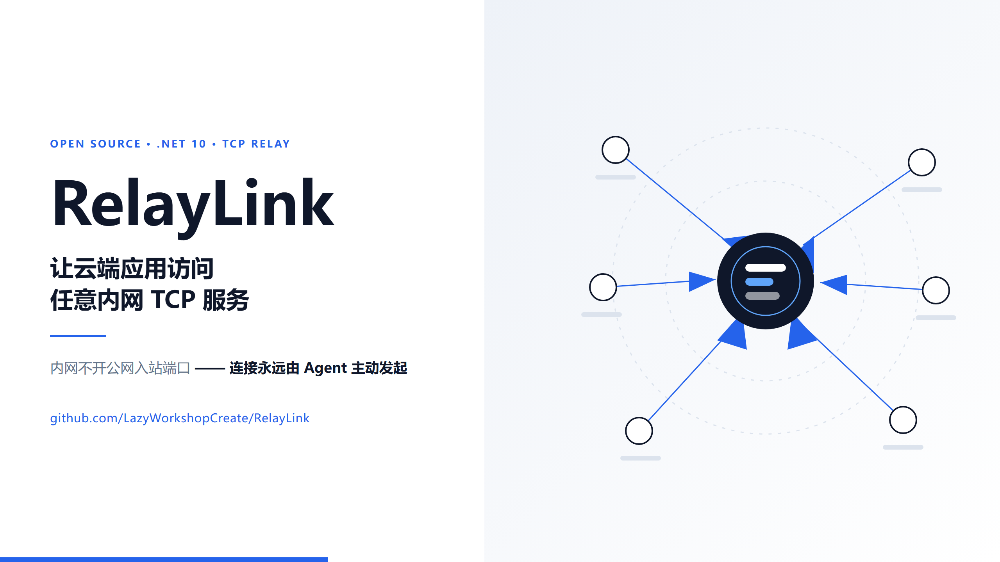
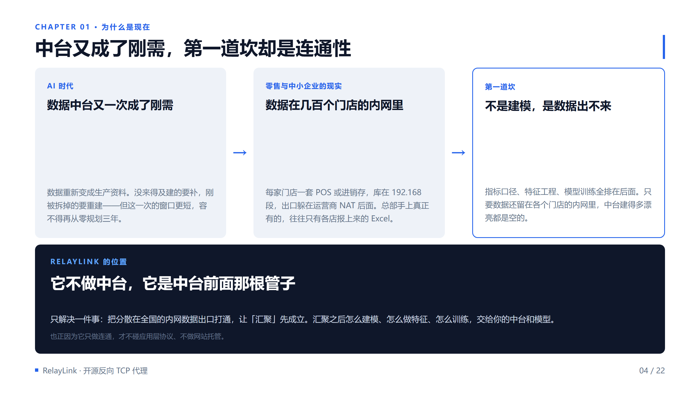
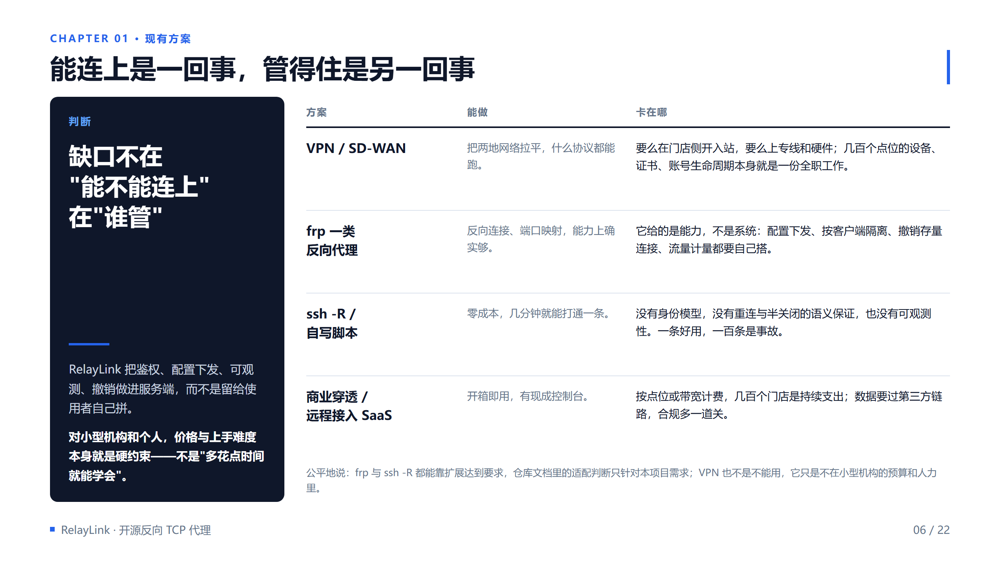
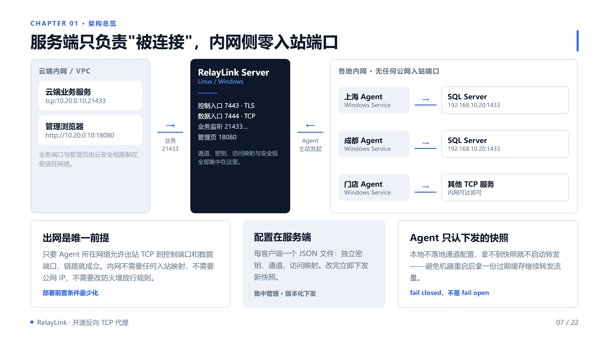
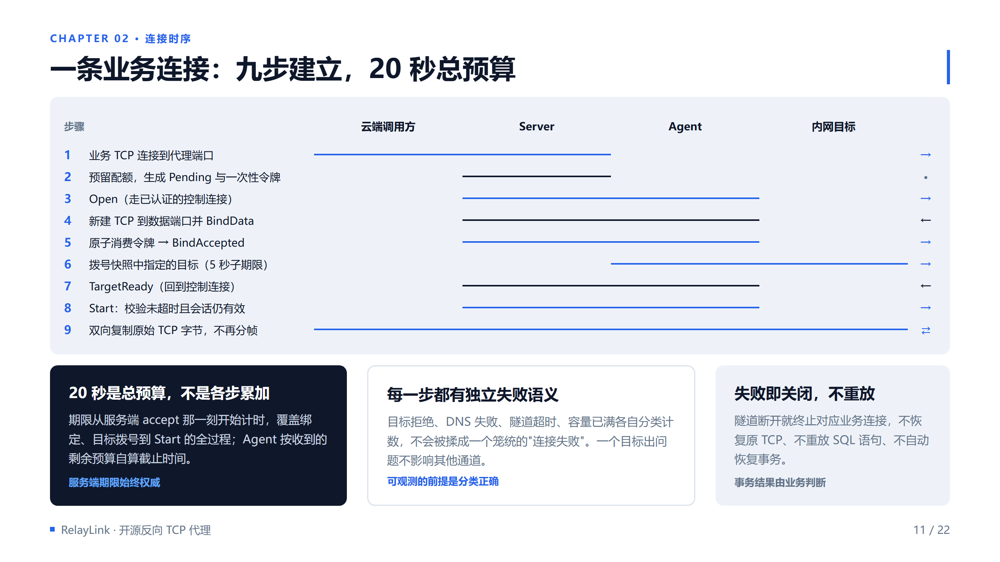
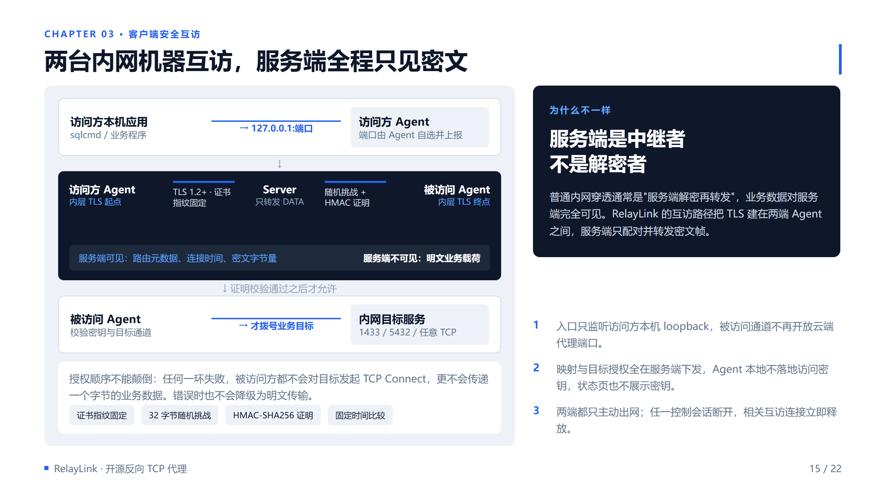
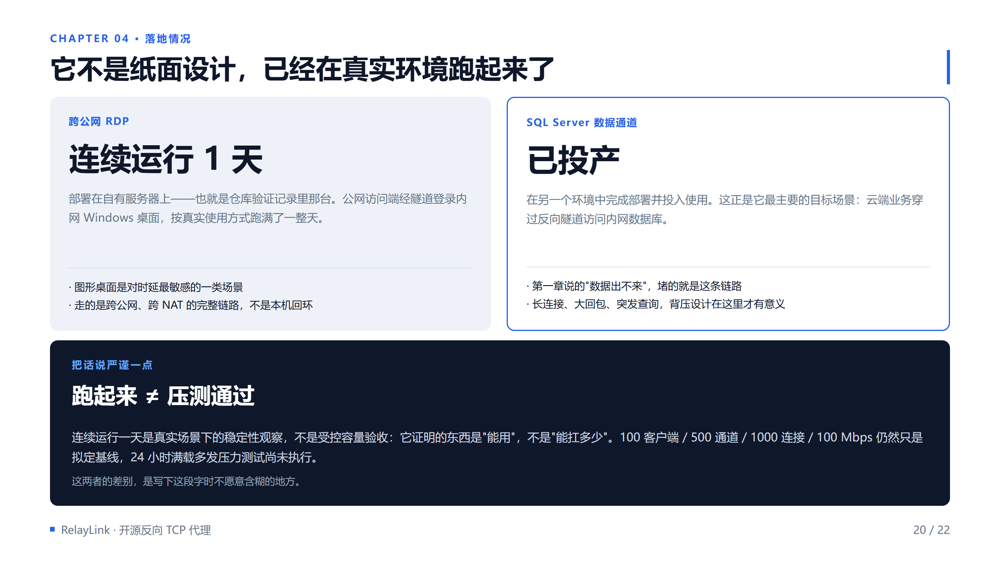
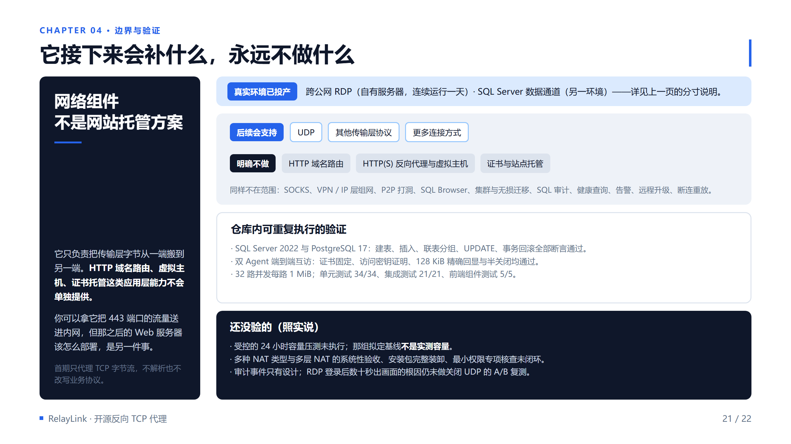

# 数据出不来，中台就是空的：一个 .NET 反向 TCP 代理和它不愿妥协的地方

> AI 时代，没来得及建、或者刚被拆掉的数据中台又一次成了刚需。但对中小型零售企业来说，第一个必须解决的问题要朴素得多：分散在全国几百个门店里的数据，到底怎么打通。而现成的 VPN 和内网穿透方案，对小型机构来说往往要么太贵、要么太难伺候。这篇文章讲我自己写的那个开源组件，以及它在协议、安全和边界上做的取舍——它不是纸面设计：跨公网 RDP 已经在自有服务器上连续跑了一天，SQL Server 通道也在另一个环境投产了。

## 为什么又是数据中台

这两年有个挺有意思的回潮：前几年被拆掉的、或者一直没建起来的数据中台，又开始被提上日程。原因不复杂——当 AI 真的要落到业务上时，大家发现决定效果的往往不是模型，而是模型能吃到什么数据。

问题在于，**中台不是从建模开始的，是从"数据能不能汇聚"开始的。**

对中小型零售企业来说，这一步的现实长这样：全国几百家门店，每家一套 POS 或进销存，数据库躺在 `192.168.x.x` 的内网里，出口躲在运营商 NAT 后面。总部真正拿到的，往往是各店报上来的 Excel——汇总过的、脱过水的、晚一到两天的。

于是第一道坎根本不是指标口径、不是特征工程、不是选型，而是**数据出不来**。

这里要先把话说清楚：**RelayLink 不是数据中台，它是中台前面那根管子。** 它只解决一件事——把分散在全国的内网数据出口打通，让"汇聚"这件事先成立。汇聚之后怎么建模、怎么做特征、怎么训练，是你的中台和模型的事，它一概不碰。

也正因为它只做连通，它才既不碰应用层协议，也不做网站托管。

## 先说清楚它解决什么问题

场景具体得有点乏味：云端有一套业务系统，要把订单同步到全国几百个门店或分支机构的数据库里。那些数据库在各自的内网，IP 大多是 `192.168.x.x`，出口在运营商 NAT 后面。

摆在面前的约束有三条，每一条都很难绕：

**第一，内网侧没有可拨号的公网地址。** 分支机构的出口是动态的，运营商 NAT 之后，云端拿不到一个能反向拨号的稳定地址。上专线或者 SD-WAN？成本远超这类同步任务的预算。

**第二，不允许为内网开放公网入站端口。** 把 1433 或 3389 暴露到公网，等于把数据库和桌面直接交出去。这一关不该过，也不该尝试。

**第三，业务系统这一侧几乎不能改。** ERP、MES 的连接串和驱动版本十年没变过，让它们改成走消息队列或者 HTTP 网关，改造量和风险都比接一条 TCP 隧道大得多。

三个约束叠在一起，能动的就只剩一件事：**让连接从内网侧主动发出去。**

那现成的方案呢？——每一条都连得上，但都在别的地方卡住：

- **VPN / SD-WAN**：拉平网络之后什么协议都能跑，但要么在门店侧开入站，要么上专线和硬件。几百个点位的设备、证书、账号生命周期，本身就是一份全职工作。
- **frp 一类反向代理**：反向连接、端口映射，能力上确实够。但它给的是**能力，不是系统**——配置下发、按客户端隔离、撤销存量连接、流量计量全要自己搭。
- **`ssh -R` / 自写脚本**：零成本，几分钟打通一条。但没有身份模型，没有重连与半关闭的语义保证，也没有可观测性。一条好用，一百条是事故。
- **商业穿透 / 远程接入 SaaS**：开箱即用，有现成控制台。但按点位或带宽计费，几百个门店是持续支出；数据还要过第三方链路，合规多一道关。

**所以缺口不在"能不能连上"，在"连上之后谁管"。** RelayLink 把鉴权、配置下发、可观测、撤销做进服务端，而不是留给使用者自己拼——几百个门店的场景下，差的往往就是这一层。

公平地说：frp 和 `ssh -R` 都能靠扩展达到要求，仓库文档里那句"适配判断"只针对本项目需求；VPN 也不是不能用，它只是不在小型机构的预算和人力里。

反向连接本身不是新东西，frp 和 `ssh -R` 都做得到。真正的工作量在于，怎么把配置下发、身份校验、可观测性和生命周期管理一起做进去，让它不是一个停在运维手上的脚本。

这里先划一条边界，免得后面读歪：**RelayLink 是一个网络组件，不是网站托管方案。** 它只负责把传输层字节从一端搬到另一端，不提供 HTTP 这类应用层协议的单独支持——没有域名路由、没有虚拟主机、没有证书托管。你可以拿它把 443 端口的流量送进内网，但那之后的 Web 服务器该怎么部署，是另一件事，得交给 nginx、Caddy 或者你自己的网关。

这个边界也决定了它后续的演进方向：**会继续变宽的是传输层**——UDP 等其他传输层协议、更多连接方式都在规划内；**明确止步的是应用层**——它永远不去理解跑在上面的协议是什么。

架构就这么几块：服务端跑在有公网 IP 的云主机上，内网的 Windows Agent 主动拨号连上来，云端业务服务连服务端的代理端口，字节流经服务端路由到对应 Agent，再由 Agent 送到本机可达的目标。

注意图里左边那条虚线框——业务端口和管理页面都只在内网可达，云安全组负责挡。**内网侧一个入站端口都不需要开**，只需要允许出站 TCP 到控制端口和数据端口。

还有一条容易被忽略的设计：Agent 不在本地维护通道配置。服务端下发快照，Agent 在内存里用；拿不到快照就不启动转发。宁可 fail closed，也不要机器重启后拿一份过期缓存继续转发流量。

## 控制口和数据口：为什么要分家

这是整个项目里我最愿意多讲两句的地方。

很多内网穿透工具是单端口的：一条连接上来，先握手协商，然后复用这条 TCP 承载所有业务流。省事，但把两件性质完全不同的事——**"谁可以连"** 和 **"搬什么字节"** ——塞进了同一个信道。

RelayLink 把它们拆成两个端口：

- **控制入口（默认 7443，走 TLS）**：只做四件事。注册认证、下发配置快照、心跳保活、为下一条业务连接派发令牌。它不接受数据绑定的首帧，也不承载任何业务字节。
- **数据入口（默认 7444，明文 TCP）**：只接受已获授权的连接绑定。绑定完成、收到 Start 之后，这条连接上不再解析任何帧，直接双向复制原始 TCP 字节。

两个端口靠**一次性令牌**在逻辑上缝合成一条业务连接：

业务连接到达时代，服务端生成 32 字节随机令牌，随 `Open` 消息通过控制连接发给 Agent；Agent 拿这个令牌去数据端口做 `BindData`；服务端用 CAS 把状态从 `AwaitingBind` 翻到 `Bound`，同时**立即清除令牌哈希**。

结果就是：令牌只能成功消费一次。重复、过期、跨会话、角色错置，全部拒绝，而且失败之后不会恢复可用。重放攻击在这个环节上没有任何空间。

代价也要说清楚：**数据入口不叠加 TLS。** 普通代理路径上这段链路是明文 TCP，绑定元数据同样不保密。所以它只适用于受信隔离链路，或者业务自身已经启用端到端 TLS（比如 SQL TLS）的场景。

我们不打算用"加一层 TLS 就好了"来糊弄这件事——多一层 TLS 意味着多一次握手、多一份证书管理，对纯内网受信链路是纯成本。真实需要的加密场景，走下面讲的互访模式。

## 一条业务连接，九步

很多人对代理的想象是"连上去就通了"。实际上一旦要考虑超时、失败分类和资源回收，建立过程就会被拆成很多步。

九步里，有几处是可以直接抄的工程经验：

**期限是总预算，不是各步累加。** 从服务端 accept 那一刻开始计 20 秒，覆盖绑定、目标拨号和 Start 的全过程。Agent 按收到的**剩余预算**自己算截止时间。这样做的好处是超时不会随步骤增加而线性膨胀，坏处是所有环节必须共享同一个预算——这是刻意选的。

**每一步有独立的失败语义。** 目标拒绝、DNS 失败、隧道超时、容量已满，各自分类计数。仪表盘上不会只看到一个笼统的"连接失败"。

**一个目标出问题，不影响其他通道。** 但控制会话断开，会连坐该客户端的全部连接。这个取舍在文档里写得很直白：我们宁可在这里做保守选择，也不要出现旧会话继续工作、令牌失去生命周期管理、密钥撤销后存量连接悬挂的局面。

**失败即关闭，不重放。** 隧道断开就终止对应业务连接，不恢复原 TCP、不重放 SQL 语句、不自动恢复事务。数据库已经提交、客户端还没收到响应的那种断线，事务结果由业务自己判断——代理不做这个主。

顺带一提配额设计：全局连接额度 2000，其中 Pending 上限 200（包含在总数内，不是额外 200 条），每客户端 100、每通道 50。每个方向只有一个约 32 KiB 的缓冲，写完已读内容才继续读下一块——慢目标会自然通过 TCP 窗口把背压传导回去，而不是在内存里无限排队。

## 凭据分三层，各管一段

身份这块，很多自研工具容易犯的错是把一把密钥用到底：既当认证凭据，又当加密材料，还兼做访问控制。RelayLink 把它拆成三层：

**32 字节的客户端密钥**，每个客户端一把，必须是密码学随机数生成的，配置检查会直接拒绝占位值和人工口令。比较用固定时间算法。它管的是"这个客户端是谁"。这把密钥不进日志、不进匿名接口、不进状态页。

**一次性绑定令牌**，每条业务连接一枚。它管的是"这条连接是不是刚被授权的"。

**互访授权**：证书指纹固定 + 每连接 32 字节随机挑战 + HMAC-SHA256 证明。它管的是"凭什么访问它"。

分层的收益在互访场景里才真正体现出来。

## 互访：服务端只当中继者，不当解密者

这是 RelayLink 和绝大多数"内网穿透"工具最本质的区别。

常见的做法是：服务端解密、再转发。业务数据在服务端是完全可见的。RelayLink 的互访路径把 TLS 建在**两端 Agent 之间**，服务端只负责配对和转发密文帧——它能看到的只有路由元数据、连接时间和密文字节量，看不到一个字节的明文业务载荷。

授权顺序是刚性的，不能颠倒：

1. 访问方校验被访问方的证书指纹。指纹由 Agent 首次认证注册时自动上报，服务端固定到客户端配置里，后续变化**不会自动覆盖**。
2. 被访问方发出每连接一枚的 32 字节随机挑战。
3. 访问方在 TLS 内返回带域分隔的 HMAC-SHA256 证明。
4. 被访问方用固定时间比较验证证明——**验证通过之前，不对目标发起 TCP Connect，更不传递任何业务字节。**

任何一环失败都不会降级为明文传输。

还有几个设计细节值得留意：

访问方的入口只监听本机 `127.0.0.1`，端口由 Agent 在配置范围内自己选并上报，服务端不接受其他客户端代报，也不会把旧端口当成可用地址。被访问的通道不会再开放云端代理端口。

映射和访问密钥全部由服务端下发，Agent 本地不落地密钥，本机只读状态页也不展示密钥。

两端都只主动出网。任一控制会话断开，相关的互访连接立即释放。

服务器端还有一层补充：**应用层安全组**。每个组包含若干 IPv4/IPv6 单地址或 CIDR，匹配依据是服务端 TCP socket 的实际来源地址，不信任任何 HTTP 转发头。规则收紧后，不再匹配的存量连接会被立刻撤销。

这里要划一条线：**安全组不是加密，它只回答"这个来源能不能进"。** 保密性和完整性得靠业务自身的端到端 TLS，或者受信隔离网络。

## 它已经在真实环境跑起来了

先摆两个事实。

**跨公网 RDP 已经投产。** 部署在我自己的一台服务器上——就是仓库验证记录里那台。公网访问端经隧道登录内网 Windows 桌面，按真实使用方式连续跑了一整天。图形桌面是对时延最敏感的一类场景，而且这条链路走的是跨公网、跨 NAT 的完整路径，不是本机回环。

**SQL Server 数据通道也已经投产。** 在另一个环境里完成部署并投入使用——正好就是这篇文章开头说的那个场景：云端业务穿过反向隧道访问内网数据库。长连接、大回包、突发查询，前面讲的背压设计在这里才算真的被用上。

但这里得马上补一句限定，否则这两个事实容易被读成比实际更大的东西：**跑起来不等于压测通过。** 连续运行一天是真实场景下的稳定性观察，它证明的是"能用"，不是"能扛多少"。需求文档里那组"100 客户端 / 500 通道 / 1000 连接 / 100 Mbps"仍然只是拟定基线，24 小时满载多发压力测试还没有做。

顺便交代一个遗留问题：之前记录的"RDP 登录后要等数十秒才出画面"，现象在生产使用中不影响可用性，但**根因至今没确认**——怀疑是访问端尝试 UDP、超时后回退 TCP，而关闭 UDP 的 A/B 复测一直没做。所以它现在还挂在"未验证"那一栏里，只不过挂的性质从"能不能用"变成了"为什么慢"。

## 运维与边界：把"没验过"也写进文档

开源项目最容易翻车的地方不是功能少，是**让人误以为它能干的事比实际多**。

所以这个仓库里有一份专门的验证状态文档，写清楚哪些跑过、哪些没跑：

**已经跑通的**：真实环境里，跨公网 RDP 在自有服务器上连续运行一天，SQL Server 数据通道在另一环境投产。仓库内可重复执行的验证包括：普通代理完整跑通 SQL Server 2022 和 PostgreSQL 17，建表、插入、联表分组、UPDATE、事务回滚全部断言通过；双 Agent 端到端加密互访在 Linux 和 Windows 上都通过，包含 128 KiB 随机字节精确回显和半关闭；32 路并发每路 1 MiB 随机字节；单元测试 34/34、集成测试 21/21、前端组件测试 5/5。

**还没验的，也照实写**：24 小时满载容量压测没做，需求文档里那组"100 客户端 / 500 通道 / 1000 连接 / 100 Mbps"是**拟定基线，不是实测容量**；多种 NAT 类型与多层 NAT 的系统性验收、Windows Server 上 Service 最小权限的专项核查、安装包在管理员会话下的完整安装卸载，都还没闭环；RDP 登录后数十秒出画面的根因也还没通过关闭 UDP 的 A/B 复测确认；审计事件目前只有设计，没实现。

**不做的事也写死在文档里**：HTTP 域名路由、SOCKS、VPN/IP 层组网、P2P 打洞、SQL Browser、集群和无损会话迁移、SQL 审计、数据库健康查询、告警发送、客户端远程升级、连接断开后重放业务。

注意这份清单里**没有 UDP**。UDP 以及更多传输层协议、更多连接方式属于后续会补的能力，只是首期没做——补的是"能搬的字节种类"，不是"开始理解应用协议"。

一句话概括它的边界：**传输层上会继续变宽，应用层上明确止步。** 这些不是"待优化"，是首期就决定不进范围。边界写在明面上，比让人踩坑之后自己试出来强。

运维侧倒是做得比较实在：管理页面匿名即可只读查看状态、通道、连接和流量历史；登录后才能改配置，用的是 PBKDF2-SHA256 密码哈希 + HttpOnly 会话 Cookie + CSRF 令牌。流量按 UTC 分钟聚合落到 SQLite，默认保留 90 天，普通字节和端到端密文字节分列存储——**只存字节增量，不存业务载荷、SQL 文本或凭据**。

交付形态是三种：Linux 服务端（systemd）、Windows 服务端（Windows Service）、Windows Agent 安装包（Inno Setup，向导必须选择 Agent 配置，没有配置不允许安装，装完在桌面创建本机状态页的快捷方式）。CI 用 GitHub Actions，推 main 或 PR 只跑校验，只有 `v1.2.3` 形式的版本 tag 才触发发行并附 SHA-256 清单。

**流水线通过不等于环境验收通过**，这两件事在文档里是分开记的。

## 想看代码的话

仓库里除了代码，还有 12 篇 ADR，把每一个取舍都记下来了：为什么要做独立数据隧道、为什么管理前端要独立成项目、为什么客户端级指纹要取代通道级指纹、为什么配置变更要撤销存量连接、为什么流量历史从 JSONL 换成 SQLite 分钟聚合……如果你对某个设计有不同意见，从 ADR 开始读最省事。

代码规模不大：约 7,000 行 C#（协议、传输、服务端、Agent 四个工程）+ 约 2,500 行 TypeScript（管理前端）。.NET 10，首期只做 TCP，后续会补 UDP 等其他传输层协议和更多连接方式。

项目地址（GitHub 搜索仓库名即可）：

**github.com/LazyWorkshopCreate/RelayLink**

从写下第一行代码到现在，这个仓库只有三天。也正因为这样，它现在最需要的不是 star，是有人来挑协议和安全设计上的毛病——尤其是上面那些标注"还没验"的地方。

如果你正好在做零售或多分支场景的数据中台，卡在"数据出不来"这一步，欢迎带着你的拓扑来提 issue。那大概才是它最该被打磨的地方。

欢迎来提 issue。
